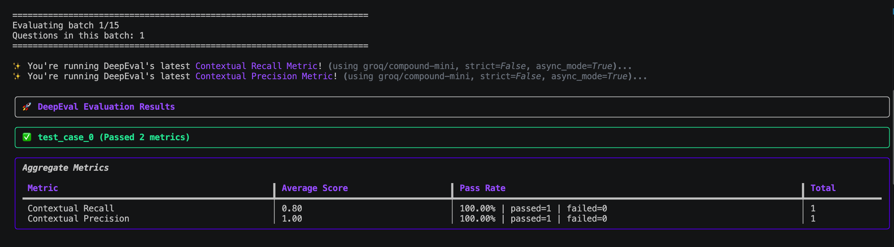
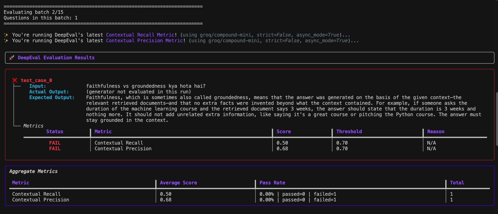

# Retriever Component Evaluation

Component-level evaluation of the **retriever** in a RAG pipeline, using [DeepEval](https://github.com/confident-ai/deepeval) with a Groq-hosted LLM as the judge.

Most RAG evaluations grade the final answer, which makes it hard to tell *where* a bad answer came from — was it the retriever that pulled the wrong chunks, or the generator that ignored good ones? This project isolates the retriever and grades it on its own, before the generator is ever involved. The generator is deliberately stubbed out so no generation quality leaks into the scores.

The corpus is a set of lecture transcripts (`.vtt` subtitle files) from an LLM-evaluation course, and the questions are the kind a student would actually ask about them.

---

## What is being measured

Two retrieval metrics, both scored by an LLM judge against a hand-written ideal answer:

| Metric | Question it answers |
|---|---|
| **Contextual Recall** | Did the retriever fetch *everything* needed to produce the ideal answer? |
| **Contextual Precision** | Are the relevant chunks ranked *above* the irrelevant ones? |

Both use a pass threshold of **0.70**.

Recall is about coverage — a low score means the answer simply isn't in what came back. Precision is about ordering — a low score means the right chunk was retrieved but buried under noise, which matters because the generator only reliably reads the top of its context. The two fail for different reasons and are fixed by different changes, which is the point of tracking them separately.

---

## Results

Evaluation runs one question per batch with a pause between batches, so each screenshot below is a single golden question.

**A question the retriever handles well** — recall 0.80, precision 1.00, both metrics pass:



**A question it does not** — recall 0.50, precision 0.68, both below threshold:



The failing case is instructive. The question is `"faithfulness vs groundedness kya hota hai?"` — code-mixed Hindi-English, phrased the way a student would actually type it. The embedding model (`all-MiniLM-L6-v2`) is English-only, so the Hindi tokens contribute nothing useful to the query vector, and retrieval degrades. Recall at 0.50 says half the ideal answer had no supporting chunk; precision at 0.68 says whatever *was* retrieved wasn't ranked well either.

> **Note:** the full 15-question run is not included. The Groq free-tier token budget ran out partway through, so only individual batches were completed. The two screenshots above are verified working runs, not the complete benchmark. Re-running the suite end to end requires a Groq key with enough quota for 15 questions × 2 metrics.

---

## How it works

```
data/*.vtt              8 lecture transcripts (WEBVTT subtitles)
        │
        │  strip timestamps + WEBVTT headers, join into one document per lecture
        ▼
RecursiveCharacterTextSplitter        chunk_size=750, overlap=100
        │
        ▼
HuggingFaceEmbeddings                 sentence-transformers/all-MiniLM-L6-v2 (local, free)
        │
        ▼
Chroma (persisted to chroma_store/)   retriever with k=5
        │
        │  for each golden question: retriever.invoke(query) → 5 chunks
        ▼
DeepEval LLMTestCase
    input             = the question
    expected_output   = hand-written ideal answer
    retrieval_context = the 5 retrieved chunks
    actual_output     = "(generator not evaluated in this run)"
        │
        ▼
ContextualRecallMetric + ContextualPrecisionMetric
    judged by groq/compound-mini via a DeepEvalBaseLLM wrapper
```

Embeddings run locally on CPU and cost nothing. The only paid/rate-limited component is the judge model.

Each lecture is stored with a `session` number in its metadata, parsed from the filename, so retrieved chunks can be traced back to the lecture they came from.

---

## Repository layout

```
src/retriever.py                        load → chunk → embed → Chroma; builds the k=5 retriever
evals/eval_retriever.py                 the evaluation harness (Groq judge, batching, metrics)
resources/generate_goldens.py           optional: draft goldens with DeepEval's Synthesizer
goldens/retriever_goldens.json          15 hand-written goldens — the set actually used
goldens/retriever_deepeval_goldens.json 1 synthesizer draft, kept as an example (not used)
data/*.vtt                              lecture transcripts
chroma_store/                           persisted vector store (rebuilt automatically if deleted)
```

### The golden set

`goldens/retriever_goldens.json` holds 15 questions, each with a hand-written `ideal_answer` and the source session:

```json
{
  "id": "g010",
  "query": "what exactly does recall at k tell me about my retriever?",
  "ideal_answer": "...",
  "source": "Session 3"
}
```

These are written by hand on purpose. `resources/generate_goldens.py` can draft goldens automatically using DeepEval's `Synthesizer`, and its output is kept in the repo as a single example — but that example is exactly why the set is hand-written. The synthesizer produced a question ("craft a sprint agenda covering 7 knowledge benchmarks…") with a long, confidently formatted answer that has essentially nothing to do with the transcripts. Grading a retriever against ungrounded goldens measures nothing. The script prints a `REVIEW EVERY ONE` warning for this reason; treat its output as a starting draft only.

---

## Running it

Requires Python 3.11+ and a [Groq API key](https://console.groq.com/).

```bash
# install (the project uses uv, but pip works too)
uv sync
# or: pip install -e .

# set the judge's API key
echo "GROQ_API_KEY=your_key_here" > .env
```

Sanity-check the retriever on its own — no API key needed, since embeddings are local:

```bash
python -m src.retriever
```

This prints the top 5 chunks for a sample query, each tagged with its session number. On first run it builds the Chroma store from the transcripts, which takes a minute; after that it loads the persisted store.

Run the evaluation:

```bash
python -m evals.eval_retriever
```

### Tuning the run

The knobs are constants at the top of `evals/eval_retriever.py`:

| Constant | Default | Purpose |
|---|---|---|
| `JUDGE_MODEL` | `groq/compound-mini` | LLM that scores the metrics |
| `THRESHOLD` | `0.7` | Minimum score to pass |
| `BATCH_SIZE` | `1` | Questions per `evaluate()` call |
| `WAIT_SECONDS` | `10` | Pause between batches |

`BATCH_SIZE=1` with a 10-second wait is a rate-limit accommodation, not a design choice — the free Groq tier will otherwise reject requests mid-run. With a paid key, raising the batch size and dropping the wait makes the suite finish far faster.

Retriever-side settings live in `src/retriever.py`: `chunk_size`, `chunk_overlap`, the embedding model name, and `k` in `search_kwargs`.

**If you change any retriever setting, delete `chroma_store/` first.** The store is only rebuilt when that directory is missing, so otherwise you will evaluate the old index and see no effect from your change.

---

## Known limitations

- **Judge quota.** The full 15-question suite has not been run end to end on the free tier. See the note under Results.
- **English-only embeddings.** `all-MiniLM-L6-v2` handles the code-mixed Hindi-English questions in the golden set poorly. A multilingual embedding model would be the first thing to try.
- **Coverage gap.** Five goldens cite "Session 9", but `data/` contains lectures 1–8. Those questions are being graded against a corpus that may not contain their answers, so their scores should be read with that in mind.
- **Duplicate transcript.** `lecture3.vtt` and `lecture4.vtt` are byte-identical, so that content is indexed twice and can occupy two of the five retrieval slots with the same text.
- **Logged hyperparameters drift.** The `hyperparameters` dict passed to `evaluate()` records `chunk_size=1000, chunk_overlap=200`, while `src/retriever.py` actually uses `750` and `100`. The evaluation itself is unaffected, but the logged run metadata is wrong.
- **Retriever only.** Faithfulness, answer relevancy, and other generator-side metrics are out of scope here by design.

---

## Stack

`langchain-chroma` · `langchain-huggingface` · `langchain-text-splitters` · `langchain-groq` · `chromadb` · `sentence-transformers` · `deepeval` · `python-dotenv`
